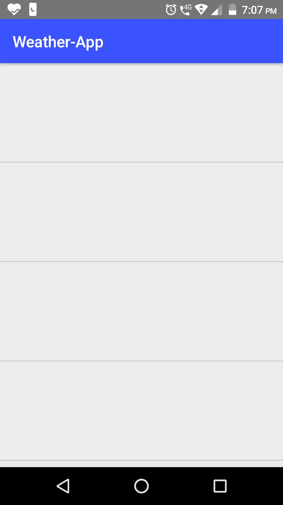
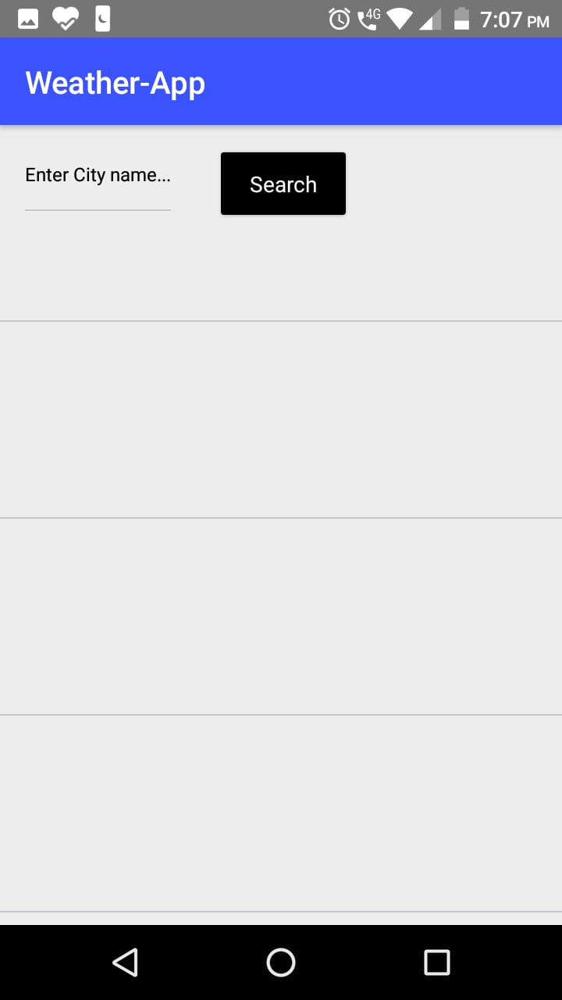
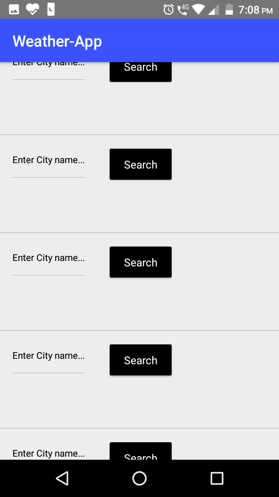
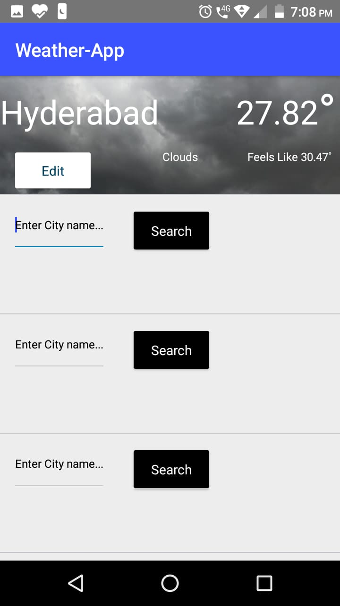
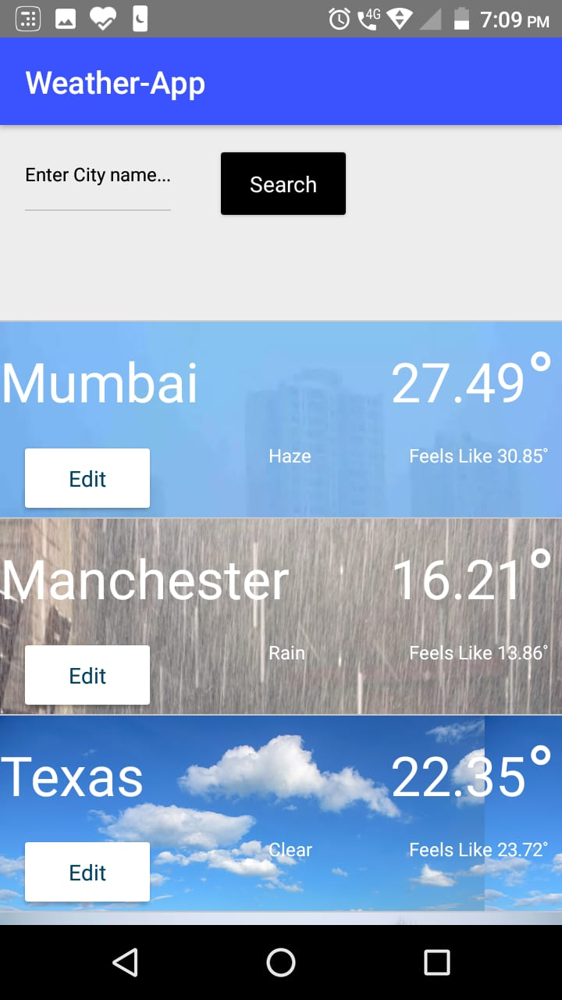
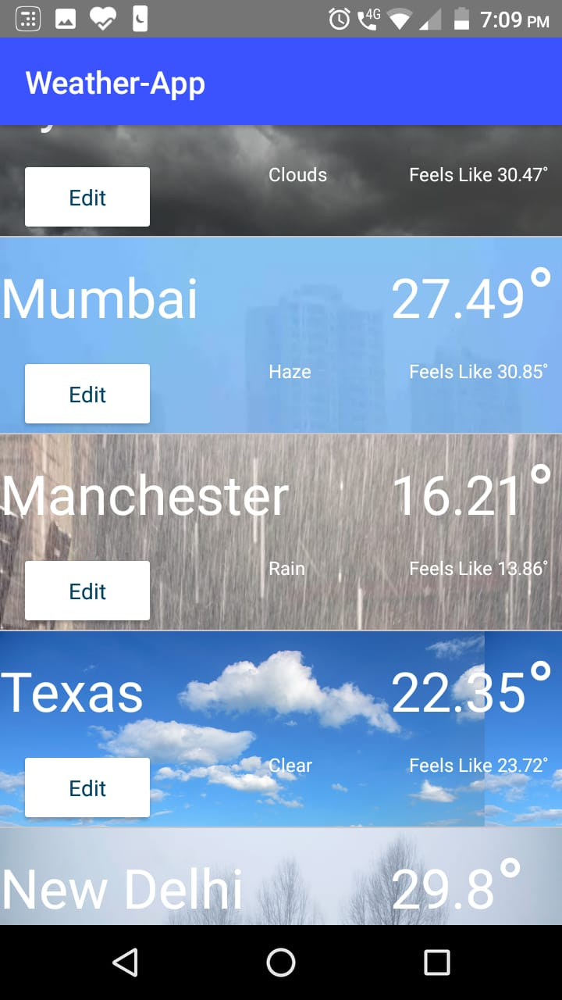

# WeatherApp
Weather Forecast Application
This Application shows the Weather Forecast of different cities, the data has been collected from Open Weather Map API.The whole Application is developed using NativeScript with Angular.

## How App Works
1. The app consists of a list of panels. Initially, all panels would be empty. Each panel is separated by a marginal line. Each panel shows the Weather data of one city.

2. On tapping on an empty panel, a text box is shown on the panel itself, asking the user to enter the city name. On entering the name and clicking on search button, the panel now shows weather data for that city.

3. Every panel have an “Edit” button - on clicking this, the user will be able to change the city shown in that panel. 

4. If there is an error like wrong city name or no city name entered,the panel shows the error and the user can re-enter the city name.

## App Features
1. Background picture that describes the current climate at the city (eg. rain, clear, clouds).

2. Edit option for every panel to change the city.

3. Open Weather Map API used for accurate data.

## API Used
[OpenWeatherMap API](https://openweathermap.org/)

## Prerequisites  
1. Install [Node.js®️](https://nodejs.org/en/download) and npm

        node -v 
        npm -v
     
2. Install node packages and go to directory having package.json (cd /go/to/app/directory having package.json)
    
       npm install
    
3. Install the latest NativeScript CLI type the following command in a Command Prompt or Terminal.
    
       npm install -g nativescript@latest
      
4. Install NativeScript Playground and NativeScript Preview Apps from Play Store(For Android) or App Store(For IOS)

       [NativeScript Playground App For IOS] https://apps.apple.com/us/app/nativescript-playground/id1263543946?ls=1
       [NativeScript Preview App For IOS] https://apps.apple.com/us/app/nativescript-preview/id1264484702
      
       [NativeScript Playground App For Android] https://play.google.com/store/apps/details?id=org.nativescript.play
       [NativeScript Preview App For Android] https://play.google.com/store/apps/details?id=org.nativescript.preview
  
 ## Running the Project
 Navigate to your project folder and run the following command to start previewing your app.
       
       tns preview
       
       Scan the QRCode with NativeScript Playground App
       
 ## App Looks Like
 
  On opening the App:  
  
    
  Clicking on any panel: 
  
   
  
    
  Enter the city name and click on search button: 
  
    
  Clicking on Edit Button: 
  
    
  Final Output Looks Like: 
  

